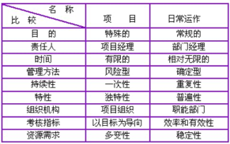

# 项目与日常运作的区别

项目与日常运作有着本质的区别。

项目是一项独一无二的任务，任何项目都会具有一个最大的特点，那就是“一次性”，也就是说，一个项目完成以后，同样的项目就再也不会发生，区别的地方有：项目的大小、地点、时间、类型等等。

而日常运作是连续不断、周而复始的重复活动，如食品厂每天制作蛋糕、邮递员每天送报纸，会计每天做账等等，这些活动都是反复进行的日常运作，并提供相同的产品、成果

