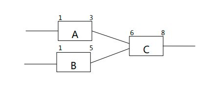

# 总浮动时间和自由浮动时间的区别

总浮动时间（也称为总时差）是指整个项目的最后一项活动的最早完成时间与项目要求
的完工时间的差值。总浮动时间为正，说明进度计划不但可以满足项目按时完成的要求，而
且还可以进一步压缩。总浮动时间为负，说明项目进度不能满足项目按时完工的要求，需要
通过赶工等进度压缩技术才能弥补时间的差距。如某项目要求100天完成，进度计划规划105
天才能完成，总浮动时间就是-5天。如果进度计划规划97天完成，总浮动时间就是+3天。
如果进度计划规划也是100天完成，总浮动时间就是0。关键路径就是总浮动时间为0或负的
路径，也即，关键路径法是一个时间约束性的进度计划规划方法，中间没有喘息的机会。关
键路径法不考虑资源的约束。
自由浮动时间（也称自由时差）指某项活动在不影响其紧后活动最早开始时间的情况下
可以延迟的时间量。是指向同一活动的各项活动总浮动时间之间的相对差值。既然自由浮动
时间是指向同一活动的各项活动的总浮动时间的相对差值，那么只有两项或更多项活动指向
同一活动时才存在自由浮动时间。自由浮动时间总是正值。下图，活动A的自由浮动时间为
2天。

